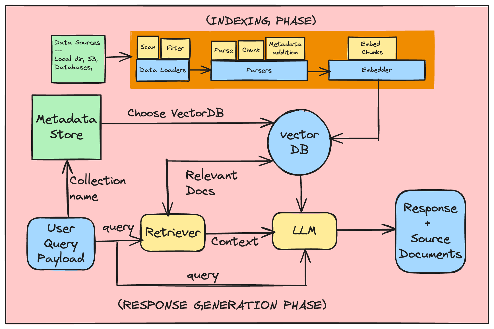

# Cognita: Building an Open Source, Modular, RAG applications for Production

Assume there is a **team A** assigned to develop RAG application for **use-case-1**, then there is **team B** that is developing RAG application for **use-case-2**, and then there is **team C**, that is just planning out for their upcoming RAG application use case. Have you wished that building RAG pipelines across multiple teams should have been easy? Each team need not start from scratch but a modular way where each team can use the same base functionality and effectively develop their own apps on top of it without any interference?

Worry not!! This is why we created **Cognita**. While RAG is undeniably impressive, the process of creating a functional application with it can be daunting. There's a significant amount to grasp regarding implementation and development practices, ranging from selecting the appropriate AI models for the specific use case to organizing data effectively to obtain the desired insights. While tools like [LangChain](https://www.langchain.com/) and [LlamaIndex](https://www.llamaindex.ai/) exist to simplify the prototype design process, there has yet to be an accessible, ready-to-use open-source RAG template that incorporates best practices and offers modular support, allowing anyone to quickly and easily utilize it.

### Advantages of Cognita:

1.  A central reusable repository of parsers, loaders, embedders and retrievers.
1.  Ability for non-technical users to play with UI - Upload documents and perform QnA using modules built by the development team.
1.  Fully API driven - which allows integration with other systems.

## Overview



Delving into the inner workings of **Cognita**, our goal was to strike a balance between full customisation and adaptability while ensuring user-friendliness right out of the box. Given the rapid pace of advancements in RAG and AI, it was imperative for us to engineer Cognita with scalability in mind, enabling seamless integration of new breakthroughs and diverse use cases. This led us to break down the RAG process into distinct modular steps (as shown in the above diagram, to be discussed in subsequent sections), facilitating easier system maintenance, the addition of new functionalities such as interoperability with other AI libraries, and enabling users to tailor the platform to their specific requirements. Our focus remains on providing users with a robust tool that not only meets their current needs but also evolves alongside technology, ensuring long-term value.

## Components

[Cognita](https://github.com/truefoundry/cognita/tree/main) is designed around seven different modules, each customisable and controllable to suit different needs:

1. Data Loaders
2. Parsers
3. Embedders
4. Rerankers
5. Vector DBs
6. Metadata Store
7. Query Controllers

### Data Loaders


These load the data from different sources like local directories, S3 buckets, databases, Truefoundry artifacts, etc. Cognita currently supports data loading from local directory, web url, Github repository and Truefoundry artifacts.
More data loaders can be easily added under `backend/modules/dataloaders/` . Once a dataloader is added you need to register it so that it can be used by the RAG application under `backend/modules/dataloaders/__init__.py`
To register a dataloader add the following:

```python
register_dataloader("MyDataLoader", MyDataLoaderClass)
```

### Parsers

In this step, we deal with different kinds of data, like regular text files, PDFs, and even Markdown files. The aim is to turn all these different types into one common format so we can work with them more easily later on. This part, called parsing, usually takes the longest and is difficult to implement when we're setting up a system like this. But using Cognita can help because it already handles the hard work of managing data pipelines for us.

Post this, we split the parsed data into uniform chunks. But why do we need this? The text we get from the files can be different lengths. If we use these long texts directly, we'll end up adding a bunch of unnecessary information. Plus, since all LLMs can only handle a certain amount of text at once, we won't be able to include all the important context needed for the question. So instead, we're going to break down the text into smaller parts for each section. Intuitively, smaller chunks will contain relevant concepts and will be less noisy compared to larger chunks.


Currently we support, parsing for `Markdown`, `PDF` and `Text` files. More data parsers can be easily added under `backend/modules/parsers/` . Once a parser is added you need to register it so that it can be used by the RAG application under `backend/modules/parsers/__init__.py`
To register a parser add the following:

```python
register_parser("MyParser", MyParserClass)
```

### Embedders

Once we've split the data into smaller pieces, we want to find the most important chunks for a specific question. One fast and effective way to do this is by using a pre-trained model (embedding model) to convert our data and the question into special codes called embeddings. Then, we compare the embeddings of each chunk of data to the one for the question. By measuring the `cosine similarity` between these embeddings, we can figure out which chunks are most closely related to the question, helping us find the best ones to use.


There are many pre-trained models available to embed the data such as models from OpenAI, Cohere, etc. The popular popular ones can be discovered through [HuggingFace's Massive Text Embedding Benchmark (MTEB)](https://huggingface.co/spaces/mteb/leaderboard) leaderboard. We provide support for OpenAI Embeddings, TrueFoundry Embeddings and also current **SOTA** embeddings (as of April, 2024) from [mixedbread-ai](https://www.mixedbread.ai/).

More embedders can be easily added under `backend/modules/embedder/` . Once a embedder is added you need to register it so that it can be used by the RAG application under `backend/modules/embedders/__init__.py`
To register a parser add the following:

```python
register_embedder("MyEmbedder", MyEmbedderClass)
```

**Note:** Remember, embeddings aren't the only method for finding important chunks. We could also use an LLM for this task! However, LLMs are much bigger than embedding models and have a limit on the amount of text they can handle at once. That's why it's smarter to use embeddings to pick the top k chunks first. Then, we can use LLMs on these fewer chunks to figure out the best ones to use as the context to answer our question.

### Rerankers

Once embedding step finds some potential matches, which can be a lot, a reranking step is applied. Reranking to makes sure the best results are at the top. As a result, we can choose the top x documents making our context more concise and prompt query shorter. We provide the support for **SOTA** reranker (as of April, 2024) from [mixedbread-ai](https://www.mixedbread.ai/) which is implemented under `backend/modules/reranker/`

### VectorDB

Once we create vectors for texts, we store them in something called a vector database. This database keeps track of these vectors so we can quickly find them later using different methods. Regular databases organize data in tables, like rows and columns, but vector databases are special because they store and find data based on these vectors. This is super useful for things like recognizing images, understanding language, or recommending stuff. For example, in a recommendation system, each item you might want to recommend (like a movie or a product) is turned into a vector, with different parts of the vector representing different features of the item, like its genre or price. Similarly, in language stuff, each word or document is turned into a vector, with parts of the vector representing features of the word or document, like how often the word is used or what it means. These vector databases are designed to handle these efficiently. Using different ways to measure how close vectors are to each other, like how similar they are or how far apart they are, we find vectors that are closest to the given user query. The most common ways to measure this are Euclidean Distance, Cosine Similarity, and Dot Product.

There are various available vector databases in the market, like Qdrant, SingleStore, Weaviate, etc. We currently support `Qdrant` and `SingleStore`. Qdrant vector db class is defined under `/backend/modules/vector_db/qdrant.py`, while SingleStore vector db class is defined under `/backend/modules/vector_db/singlestore.py`

Other vector dbs can be added too in the `vector_db` folder and can be registered under `/backend/modules/vector_db/__init__.py`

To add any vector DB support in Cognita, user needs to do the following:

-   Create the class that inherits from `BaseVectorDB` (`from backend.modules.vector_db.base import BaseVectorDB`) and initialize it with `VectorDBConfig` (`from backend.types import VectorDBConfig`)
-   Implement the following methods:
    -   `create_collection`: To intialize the collection/project/table in vector db.
    -   `upsert_documents`: To insert the documents in the db.
    -   `get_collections`: Get all the collections present in the db.
    -   `delete_collection`: To delete the collection from the db.
    -   `get_vector_store`: To get the vector store for the given collection.
    -   `get_vector_client`: To get the vector client for the given collection if any.
    -   `list_data_point_vectors`: To list already present vectors in the db that are similar to the documents being inserted.
    -   `delete_data_point_vectors`: To delete the vectors from the db, used to remove old vectors of the updated document.

We now show how we can add a new vector db to the RAG system. We take example of both `Qdrant` and `SingleStore` vector dbs.

#### Qdrant

[Qdrant](https://qdrant.tech/documentation/quick-start/) is an Open-Source Vector Database and Vector Search Engine written in Rust. It provides fast and scalable vector similarity search service with convenient API. To add Qdrant vector db to the RAG system, follow the below steps:

> In .env `VECTOR_DB_CONFIG = '{"url": "<url_here>", "provider": "qdrant"}'` # Qdrant URL
> `VECTOR_DB_CONFIG='{"provider":"qdrant","local":"true"}'` # For local file based Qdrant instance without docker

1. Create a new class `QdrantVectorDB` in `backend/modules/vector_db/qdrant.py` that inherits from `BaseVectorDB` and initialize it with `VectorDBConfig`

    ```python
    from langchain_community.vectorstores.qdrant import Qdrant
    from qdrant_client.http.models import VectorParams, Distance
    from qdrant_client import QdrantClient, models

    class QdrantVectorDB(BaseVectorDB):
        def __init__(self, config: VectorDBConfig):
            ...
            # Initialize the qdrant client
            self.qdrant_client = QdrantClient(
                url=self.url,
                port=self.port,
                prefer_grpc=self.prefer_grpc,
                prefix=self.prefix,
            )
    ```

2. Override the `create_collection` method to create a collection in Qdrant

    ```python
    def create_collection(self, collection_name: str, embeddings: Embeddings):
        # Calculate embedding size
        partial_embeddings = embeddings.embed_documents(["Initial document"])
        vector_size = len(partial_embeddings[0])

        # Create collection given the embeding dimension and simalrity metric
        self.qdrant_client.create_collection(
            collection_name=collection_name,
            vectors_config=VectorParams(
                size=vector_size,  # embedding dimension
                distance=Distance.COSINE,
            ),
            replication_factor=3,
        )

        # Create metadata index for the collection
        self.qdrant_client.create_payload_index(
            collection_name=collection_name,
            field_name=f"metadata.{DATA_POINT_FQN_METADATA_KEY}",
            field_schema=models.PayloadSchemaType.KEYWORD,
        )
    ```

3. Override the `upsert_documents` method to insert the documents in the db

    ```python
    def upsert_documents(
        self,
        collection_name: str,
        documents,
        embeddings: Embeddings,
        incremental: bool = True,
    ):
        # Get the data point fqns from the documents
        # fqns uniquely identify the documents
        # This is used to delete the outdated documents from the db
        data_point_fqns = []
        for document in documents:
            if document.metadata.get(DATA_POINT_FQN_METADATA_KEY):
                data_point_fqns.append(
                    document.metadata.get(DATA_POINT_FQN_METADATA_KEY)
                )

        # Add Documents
        Qdrant(
            client=self.qdrant_client,
            collection_name=collection_name,
            embeddings=embeddings,
        ).add_documents(documents=documents)

        # Get the record ids that are already present in the db (Existing documents that are modified)
        # These docs should be removed from the db
        # Used when incremental indexing is enabled
        record_ids_to_be_upserted: List[str] = self._get_records_to_be_upserted(
            collection_name=collection_name,
            data_point_fqns=data_point_fqns,
            incremental=incremental,
        )

        # Delete Documents
        if len(record_ids_to_be_upserted):
            for i in range(0, len(record_ids_to_be_upserted), BATCH_SIZE):
                record_ids_to_be_processed = record_ids_to_be_upserted[
                    i : i + BATCH_SIZE
                ]
                self.qdrant_client.delete(
                    collection_name=collection_name,
                    points_selector=models.PointIdsList(
                        points=record_ids_to_be_processed,
                    ),
                )

    # This method is used to get the records that are already present in the db
    def _get_records_to_be_upserted(
        self, collection_name: str,
        data_point_fqns: List[str],
        incremental: bool
    ):
        if not incremental:
            return []
        # For incremental deletion, we delete the documents with the same document_id
        stop = False
        offset = None
        record_ids_to_be_upserted = []

        # we fetch the records in batches based on the data_point_fqns
        while stop is not True:
            records, next_offset = self.qdrant_client.scroll(
                collection_name=collection_name,
                scroll_filter=models.Filter(
                    should=[
                        models.FieldCondition(
                            key=f"metadata.{DATA_POINT_FQN_METADATA_KEY}",
                            match=models.MatchAny(
                                any=data_point_fqns,
                            ),
                        ),
                    ]
                ),
                limit=BATCH_SIZE,
                offset=offset,
                with_payload=False,
                with_vectors=False,
            )
            for record in records:
                record_ids_to_be_upserted.append(record.id)
                if len(record_ids_to_be_upserted) > MAX_SCROLL_LIMIT:
                    stop = True
                    break
            if next_offset is None:
                stop = True
            else:
                offset = next_offset
        return record_ids_to_be_upserted
    ```

4. Override the `get_collections` method to get all the collections present in the db

    ```python
    def get_collections(self):
        collections = self.qdrant_client.list_collections()
        return [collection.name for collection in collections]
    ```

5. Override the `delete_collection` method to delete the collection from the db

    ```python
    def delete_collection(self, collection_name: str):
        self.qdrant_client.delete_collection(collection_name=collection_name)
    ```

6. Override the `get_vector_store` method to get the vector store for the given collection

    ```python
    def get_vector_store(self, collection_name: str, embeddings: Embeddings):
        return Qdrant(
                client=self.qdrant_client,
                embeddings=embeddings,
                collection_name=collection_name,
            )
    ```

7. Override the `get_vector_client` method to get the vector client for the given collection if any

    ```python
    def get_vector_client(self):
        return self.qdrant_client
    ```

8. Override the `list_data_point_vectors` method to list already present vectors in the db that are similar to the documents being inserted

    ```python
    def list_data_point_vectors(
        self, collection_name: str,
        data_source_fqn: str,
        batch_size: int
    ) -> List[DataPointVector]:

        stop = False
        offset = None
        data_point_vectors: List[DataPointVector] = []

        # Get the vectors that match with the doc unique identifier
        # Data point is an object that has vector_id, fqn and hash
        # hash is calculated during parsing and chunking phase
        while stop is not True:
            records, next_offset = self.qdrant_client.scroll(
                collection_name=collection_name,
                limit=batch_size,
                with_payload=[
                    f"metadata.{DATA_POINT_FQN_METADATA_KEY}",
                    f"metadata.{DATA_POINT_HASH_METADATA_KEY}",
                ],
                # filter the records based on the data_point_fqn
                scroll_filter=models.Filter(
                    should=[
                        models.FieldCondition(
                            key=f"metadata.{DATA_POINT_FQN_METADATA_KEY}",
                            match=models.MatchText(
                                text=data_source_fqn,
                            ),
                        ),
                    ]
                ),
                with_vectors=False,
                offset=offset,
            )
            for record in records:
                metadata: dict = record.payload.get("metadata")
                if (
                    metadata
                    and metadata.get(DATA_POINT_FQN_METADATA_KEY)
                    and metadata.get(DATA_POINT_HASH_METADATA_KEY)
                ):
                    # Create a DataPointVector object
                    data_point_vectors.append(
                        DataPointVector(
                            data_point_vector_id=record.id,
                            data_point_fqn=metadata.get(DATA_POINT_FQN_METADATA_KEY),
                            data_point_hash=metadata.get(DATA_POINT_HASH_METADATA_KEY),
                        )
                    )
                if len(data_point_vectors) > MAX_SCROLL_LIMIT:
                    stop = True
                    break
            if next_offset is None:
                stop = True
            else:
                offset = next_offset
        return data_point_vectors
    ```

9. Override the `delete_data_point_vectors` method to delete the vectors from the db, used to remove old vectors of the updated document

    ```python
    def delete_data_point_vectors(
        self,
        collection_name: str,
        data_point_vectors: List[DataPointVector],
        batch_size: int = BATCH_SIZE,
    ):

        vectors_to_be_deleted_count = len(data_point_vectors)
        deleted_vectors_count = 0

        # delete the vectors in batches
        for i in range(0, vectors_to_be_deleted_count, batch_size):
            data_point_vectors_to_be_processed = data_point_vectors[i : i + batch_size]
            # Delete the vectors from the db
            self.qdrant_client.delete(
                collection_name=collection_name,
                points_selector=models.PointIdsList(
                    points=[
                        document_vector_point.data_point_vector_id
                        for document_vector_point in data_point_vectors_to_be_processed
                    ],
                ),
            )
            # Increment the deleted vectors count
            deleted_vectors_count = deleted_vectors_count + len(data_point_vectors_to_be_processed)
    ```

### SingleStore

SingleStore offers powerful vector database functionality perfectly suited for AI-based applications, chatbots, image recognition and more, eliminating the need for you to run a speciality vector database solely for your vector workloads. Unlike traditional vector databases, SingleStore stores vector data in relational tables alongside other types of data. Co-locating vector data with related data allows you to easily query extended metadata and other attributes of your vector data with the full power of SQL.

SingleStore provides a free tier for developers to get started with their vector database. You can sign up for a free account [here](https://www.singlestore.com/cloud-trial/). Upon signup, go to `Cloud` -> `workspace` -> `Create User`. Use the credentials to connect to the SingleStore instance.

> In .env file: VECTOR_DB_CONFIG = '{"url": "<url_here>", "provider": "singlestore"}'

To add SingleStore vector db to the RAG system, follow the below steps:

0. We want to add extra columns to table to store vector id hence, we override SingleStoreDB.

    ```python
    from langchain_community.vectorstores.singlestoredb import SingleStoreDB
    import singlestoredb as s2

    class SSDB(SingleStoreDB):
        def _create_table(self: SingleStoreDB) -> None:
            """Create table if it doesn't exist."""
            conn = self.connection_pool.connect()
            try:
                cur = conn.cursor()
                # Overriding the default table creation behaviour this adds id as autoinc primary key
                try:
                    if self.use_vector_index:
                        index_options = ""
                        if self.vector_index_options and len(self.vector_index_options) > 0:
                            index_options = "INDEX_OPTIONS '{}'".format(
                                json.dumps(self.vector_index_options)
                            )
                        cur.execute(
                            """CREATE TABLE IF NOT EXISTS {}
                            (id BIGINT AUTO_INCREMENT PRIMARY KEY, {} TEXT CHARACTER SET utf8mb4 COLLATE utf8mb4_general_ci,
                            {} VECTOR({}, F32) NOT NULL, {} JSON,
                            VECTOR INDEX {} ({}) {});""".format(
                                self.table_name,
                                self.content_field,
                                self.vector_field,
                                self.vector_size,
                                self.metadata_field,
                                self.vector_index_name,
                                self.vector_field,
                                index_options,
                            ),
                        )
                    else:
                        cur.execute(
                            """CREATE TABLE IF NOT EXISTS {}
                            (id BIGINT AUTO_INCREMENT PRIMARY KEY, {} TEXT CHARACTER SET utf8mb4 COLLATE utf8mb4_general_ci,
                            {} BLOB, {} JSON);""".format(
                                self.table_name,
                                self.content_field,
                                self.vector_field,
                                self.metadata_field,
                            ),
                        )
                finally:
                    cur.close()
            finally:
                conn.close()


        def add_texts(
            self,
            texts: Iterable[str],
            metadatas: Optional[List[dict]] = None,
            embeddings: Optional[List[List[float]]] = None,
            **kwargs: Any,
        ) -> List[str]:
            """Add more texts to the vectorstore.

            Args:
                texts (Iterable[str]): Iterable of strings/text to add to the vectorstore.
                metadatas (Optional[List[dict]], optional): Optional list of metadatas.
                    Defaults to None.
                embeddings (Optional[List[List[float]]], optional): Optional pre-generated
                    embeddings. Defaults to None.

            Returns:
                List[str]: empty list
            """
            conn = self.connection_pool.connect()
            try:
                cur = conn.cursor()
                try:
                    # Write data to singlestore db
                    for i, text in enumerate(texts):
                        # Use provided values by default or fallback
                        metadata = metadatas[i] if metadatas else {}
                        embedding = (
                            embeddings[i]
                            if embeddings
                            else self.embedding.embed_documents([text])[0]
                        )
                        # Overriding insert statement to handle autoincrement id
                        cur.execute(
                            "INSERT INTO {} (content, vector, metadata) VALUES (%s, JSON_ARRAY_PACK(%s), %s)".format(
                                self.table_name
                            ),
                            (
                                text,
                                "[{}]".format(",".join(map(str, embedding))),
                                json.dumps(metadata),
                            ),
                        )
                    if self.use_vector_index:
                        cur.execute("OPTIMIZE TABLE {} FLUSH;".format(self.table_name))
                finally:
                    cur.close()
            finally:
                conn.close()
            return []
    ```

1. Create a new class `SingleStoreVectorDB` in `backend/modules/vector_db/singlestore.py` that inherits from `BaseVectorDB` and initialize it with `VectorDBConfig`

    ```python
    class SingleStoreVectorDB(BaseVectorDB):
        def __init__(self, config: VectorDBConfig):
            # url: mysql://{user}:{password}@{host}:{port}/{db}
            self.host = config.url
    ```

2. Override the `create_collection` method to create a collection in SingleStore

    ```python
    def create_collection(self, collection_name: str, embeddings: Embeddings):
        # Calculate embedding size
        partial_embeddings = embeddings.embed_documents(["Initial document"])
        vector_size = len(partial_embeddings[0])

        # Create collection
        # we keep vector_filed, content_field as default values
        SSDB(
            embedding=embeddings,
            host=self.host,
            table_name=collection_name,
            vector_size=vector_size,
            use_vector_index=True,
        )
    ```

3. Override the `upsert_documents` method to insert the documents in the db

    ```python
    def upsert_documents(
        self,
        collection_name: str,
        documents: List[Document],
        embeddings: Embeddings,
        incremental: bool = True,
    ):
        # Get the data point fqns from the documents
        data_point_fqns = []
        for document in documents:
            if document.metadata.get(DATA_POINT_FQN_METADATA_KEY):
                data_point_fqns.append(
                    document.metadata.get(DATA_POINT_FQN_METADATA_KEY)
                )

        try:
            # Add documents to the table
            SSDB.from_documents(
                embedding=embeddings,
                documents=documents,
                table_name=collection_name,
                host=self.host,
            )
            logger.debug(
                f"[SingleStore] Added {len(documents)} documents to collection {collection_name}"
            )
        except Exception as e:
            logger.error(
                f"[SingleStore] Failed to add documents to collection {collection_name}: {e}"
            )
    ```

4. Override the `get_collections` method to get all the collections present in the db

    ```python
    def get_collections(self) -> List[str]:
        # Create connection to SingleStore
        conn = s2.connect(self.host)
        try:
            cur = conn.cursor()
            try:
                # Get all the tables in the db
                cur.execute("SHOW TABLES")
                return [row[0] for row in cur.fetchall()]
            except Exception as e:
                logger.error(
                    f"[SingleStore] Failed to get collections: {e}"
                )
            finally:
                cur.close()
        except Exception as e:
            logger.error(
                f"[SingleStore] Failed to get collections: {e}"
            )
        finally:
            conn.close()
    ```

5. Override the `delete_collection` method to delete the collection from the db

    ```python
    def delete_collection(self, collection_name: str):
        # Create connection to SingleStore
        conn = s2.connect(self.host)
        try:
            cur = conn.cursor()
            try:
                # Drop the table
                cur.execute(f"DROP TABLE {collection_name}")
                logger.debug(f"[SingleStore] Deleted collection {collection_name}")
            except Exception as e:
                logger.error(
                    f"[SingleStore] Failed to delete collection {collection_name}: {e}"
                )
            finally:
                cur.close()
        except Exception as e:
            logger.error(
                f"[SingleStore] Failed to delete collection {collection_name}: {e}"
            )
        finally:
            conn.close()
    ```

6. Override the `get_vector_store` method to get the vector store for the given collection

    ```python
    def get_vector_store(self, collection_name: str, embeddings: Embeddings):
        return SSDB(
            embedding=embeddings,
            host=self.host,
            table_name=collection_name,
        )
    ```

7. Override the `get_vector_client` method to get the vector client for the given collection if any

    ```python
    def get_vector_client(self):
        return s2.connect(self.host)
    ```

8. Override the `list_data_point_vectors` method to list already present vectors in the db that are similar to the documents being inserted

    ```python
    def list_data_point_vectors(
        self,
        collection_name: str,
        data_source_fqn: str,
    ) -> List[DataPointVector]:
        data_point_vectors: List[DataPointVector] = []
        logger.debug(f"data_source_fqn: {data_source_fqn}")

        # Get all data point vectors from table upto MAX_SCROLL_LIMIT
        conn = s2.connect(self.host)
        try:
            curr = conn.cursor()

            # Remove all data point vectors with the same data_source_fqn
            curr.execute(f"SELECT * FROM {collection_name} WHERE JSON_EXTRACT_JSON(metadata, '{DATA_POINT_FQN_METADATA_KEY}') LIKE '%{data_source_fqn}%' LIMIT {MAX_SCROLL_LIMIT}")

            for record in curr:
                # id, content, vector, metadata
                id, _, _, metadata = record
                if (
                    metadata
                    and metadata.get(DATA_POINT_FQN_METADATA_KEY)
                    and metadata.get(DATA_POINT_HASH_METADATA_KEY)
                ):
                    # Create a DataPointVector object
                    data_point_vectors.append(
                        DataPointVector(
                            data_point_vector_id=id,
                            data_point_fqn=metadata.get(DATA_POINT_FQN_METADATA_KEY),
                            data_point_hash=metadata.get(DATA_POINT_HASH_METADATA_KEY),
                        )
                    )
        except Exception as e:
            logger.error(
                f"[SingleStore] Failed to list data point vectors: {e}"
            )
        finally:
            conn.close()

        logger.debug(
            f"[SingleStore] Listing {len(data_point_vectors)} data point vectors for collection {collection_name}"
        )
        return data_point_vectors
    ```

9. Override the `delete_data_point_vectors` method to delete the vectors from the db, used to remove old vectors of the updated document

    ```python
    def delete_data_point_vectors(
        self,
        collection_name: str,
        data_point_vectors: List[DataPointVector],
        batch_size: int =BATCH_SIZE,
    ):
        if len(data_point_vectors) > 0:
            # Create connection to SingleStore
            conn = s2.connect(self.host)

            try:
                vectors_to_be_deleted_count = len(data_point_vectors)
                curr = conn.cursor()

                # Delete the vectors as per the data_point_vector_id
                curr.execute(
                    f"DELETE FROM {collection_name} WHERE id in ({', '.join(data_point_vector.data_point_vector_id for data_point_vector in data_point_vectors)})"
                )
                logger.debug(
                    f"[SingleStore] Deleted {vectors_to_be_deleted_count} data point vectors"
                )
            except Exception as e:
                logger.error(
                    f"[SingleStore] Failed to delete data point vectors: {e}"
                )
            finally:
                conn.close()
    ```

### Metadata Store

This contains the necessary configurations that uniquely define a project or RAG app. A RAG app may contain set of documents from one or more data sources combined which we term as `collection`. The documents from these data sources are indexed into the vector db using data loading + parsing + embedding methods.
For each RAG use-case, the metadata store contains:

-   Name of the collection
-   Name of the associated Vector DB used
-   Linked Data Sources
-   Parsing Configuration for each data source
-   Embedding Model and it's configuration to be used

We currently define two ways to store this data, one `locally` and other using `Truefoudry`. These stores are defined under - `backend/modules/metada_store/`

### Query Controllers

Once the data is indexed and stored in vector db, now it's time to combine all the parts together to use our app. Query Controllers just do that! They help us retrieve answer for the corresponding user query. A typical query controller steps are as follows:

1.  Users sends a request payload that contains the query, collection name, llm configuration, promt, retriever and it's configuration.
2.  Based on the `collection name` releavant `vector db` is fectched with it's configuration like embedder used, vector db type, etc
3.  Based on the `query`, relevant docs are retrieved using the `retriever` from vector db.
4.  The fetched documents form the `context` and along with the query a.k.a `question` is given to the `LLM` to generate the answer. This step can also involve prompt tuning.
5.  If required, along with the generated answer relevant document chunks are also returned in the response.

**Note:** In case of agents the intermediate steps can also be streamed. It is up to the specific app to decide.

> Query controller methods can be directly exposed as an API, by adding http decorators to the respective functions.

To add your own query controller perform the following steps:

1. Each RAG use-case should typically have a separate folder that contains the query controller. Assume our folder is `app-2`. Hence we shall write our controller under `/backend/modules/query_controller/app-2/controller.py`
2. Add `query_controller` decorator to your class and pass the name of your custom controller as argument
3. Add methods to this controller as per your needs and use our http decorators like `post`, `get`, `delete` to make your methods an API

```python
from backend.server.decorator import post
@query_controller("/app-2")
class MyCustomController():
    ...
    @post("/answer")
    def answer(query: str):
        # Write code to express your logic for answer
        # This API will be exposed as POST /my-controller/answer
        ...
```

4. Import your custom controller class at `backend/modules/query_controllers/__init__.py`

```python
from backend.modules.query_controllers.sample_controller.controller import MyCustomController
```

A sample query controller is written under:
`/backend/modules/query_controller/example/controller.py`
Please refer for better understanding

## Cognita - Process Flow

A typical Cognita process consists of two phases:

1. Data indexing
2. Response Generation

### Data Indexing


This phase involves loading data from sources, parsing the documents present in these sources and indexing them in the vector db. To handle large quantities of documents encountered in production, Cognita takes this a step further.

1. Cognita groups documents in batches, rather than indexing them all together.
2. Cognita keeps computes and keeps track of document hash so that whenever a new document is added to the data source for indexing only those documents are indexed rather than indexing the complete data source, this save time and compute dramatically.
3. This mode of indexing is also referred as `INCREMENTAL` indexing, there is also other mode that is supported in Cognita that is `FULL` indexing. `FULL` indexing re-ingests the data into vector db irrespective of any vector data present for the given collection.

### Response Generation


Response generation phase makes a call to the `/answer` endpoint of your defined `QueryController` and generates the response for the requested query.

## Using Cognita UI

The following steps will showcase how to use the cognita UI to query documents:

1. Create Data Source

    - Click on `Data Sources` tab
      
    - Click `+ New Datasource`
    - Data source type can be either files from local directory, web url, github url or providing Truefoundry artifact FQN.
        - E.g: If `Localdir` is selected upload files from your machine and click `Submit`.
    - Created Data sources list will be available in the Data Sources tab.
      

2. Create Collection
    - Click on `Collections` tab
    - Click `+ New Collection`
      
    - Enter Collection Name
    - Select Embedding Model
    - Add earlier created data source and the necessary configuration
    - Click `Process` to create the collection and index the data.
      
3. As soon as you create the collection, data ingestion begins, you can view it's status by selecting your collection in collections tab. You can also add additional data sources later on and index them in the collection.
   
4. Response generation
   

    - Select the collection
    - Select the LLM and it's configuration
    - Select the document retriever
    - Write the prompt or use the default prompt
    - Ask the query
