# Cognita: Building an Open Source, Modular, RAG applications for Production

Assume there is a **team A** assigned to develop RAG application for **use-case-1**, then there is **team B** that is developing RAG application for **use-case-2**, and then there is **team C**, that is just planning out for their upcoming RAG application use case. Have you wished that building RAG pipelines across multiple teams should have been easy? Each team need not start from scratch but a modular way where each team can use the same base functionality and effectively develop their own apps on top of it without any interference?

Worry not!! This is why we created **Cognita**. While RAG is undeniably impressive, the process of creating a functional application with it can be daunting. There's a significant amount to grasp regarding implementation and development practices, ranging from selecting the appropriate AI models for the specific use case to organizing data effectively to obtain the desired insights. While tools like [LangChain](https://www.langchain.com/) and [LlamaIndex](https://www.llamaindex.ai/) exist to simplify the prototype design process, there has yet to be an accessible, ready-to-use open-source RAG template that incorporates best practices and offers modular support, allowing anyone to quickly and easily utilize it.

### Advantages of Cognita:

1.  A central reusable repository of parsers, loaders, embedders and retrievers.
1.  Ability for non-technical users to play with UI - Upload documents and perform QnA using modules built by the development team.
1.  Fully API driven - which allows integration with other systems.

## Overview

Delving into the inner workings of **Cognita**, our goal was to strike a balance between full customisation and adaptability while ensuring user-friendliness right out of the box. Given the rapid pace of advancements in RAG and AI, it was imperative for us to engineer Cognita with scalability in mind, enabling seamless integration of new breakthroughs and diverse use cases. This led us to break down the RAG process into distinct modular steps, facilitating easier system maintenance, the addition of new functionalities such as interoperability with other AI libraries, and enabling users to tailor the platform to their specific requirements. Our focus remains on providing users with a robust tool that not only meets their current needs but also evolves alongside technology, ensuring long-term value.

## Components

[Cognita](https://github.com/truefoundry/cognita/tree/main) is designed around seven different modules, each customisable and controllable to suit different needs:

1. Data Loaders
2. Parsers
3. Embedders
4. Rerankers
5. Vector DBs
6. Metadata Store
7. Query Controllers

### Data Loaders

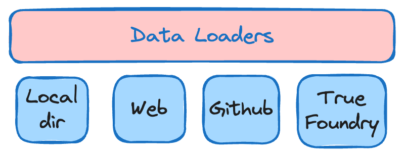

These load the data from different sources like local directories, S3 buckets, databases, Truefoundry artifacts, etc. Cognita currently supports data loading from local directory, web url, Github repository and Truefoundry artifacts.
More data loaders can be easily added under `backend/modules/dataloaders/` . Once a dataloader is added you need to register it so that it can be used by the RAG application under `backend/modules/dataloaders/__init__.py`
To register a dataloader add the following:

```python
register_dataloader("MyDataLoader", MyDataLoaderClass)
```

### Parsers

In this step, we deal with different kinds of data, like regular text files, PDFs, and even Markdown files. The aim is to turn all these different types into one common format so we can work with them more easily later on. This part, called parsing, usually takes the longest and is difficult to implement when we're setting up a system like this. But using Cognita can help because it already handles the hard work of managing data pipelines for us.

Post this, we split the parsed data into uniform chunks. But why do we need this? The text we get from the files can be different lengths. If we use these long texts directly, we'll end up adding a bunch of unnecessary information. Plus, since all LLMs can only handle a certain amount of text at once, we won't be able to include all the important context needed for the question. So instead, we're going to break down the text into smaller parts for each section. Intuitively, smaller chunks will contain relevant concepts and will be less noisy compared to larger chunks.

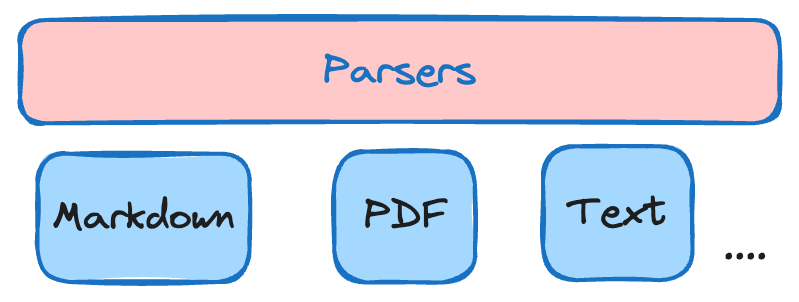

Currently we support, parsing for `Markdown`, `PDF` and `Text` files. More data parsers can be easily added under `backend/modules/parsers/` . Once a parser is added you need to register it so that it can be used by the RAG application under `backend/modules/parsers/__init__.py`
To register a parser add the following:

```python
register_parser("MyParser", MyParserClass)
```

### Embedders

Once we've split the data into smaller pieces, we want to find the most important chunks for a specific question. One fast and effective way to do this is by using a pre-trained model (embedding model) to convert our data and the question into special codes called embeddings. Then, we compare the embeddings of each chunk of data to the one for the question. By measuring the `cosine similarity` between these embeddings, we can figure out which chunks are most closely related to the question, helping us find the best ones to use.

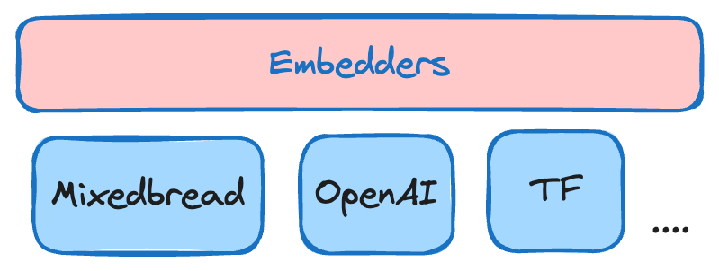

There are many pre-trained models available to embed the data such as models from OpenAI, Cohere, etc. The popular popular ones can be discovered through [HuggingFace's Massive Text Embedding Benchmark (MTEB)](https://huggingface.co/spaces/mteb/leaderboard) leaderboard. We provide support for OpenAI Embeddings, TrueFoundry Embeddings and also current **SOTA** embeddings (as of April, 2024) from [mixedbread-ai](https://www.mixedbread.ai/).

More embedders can be easily added under `backend/modules/embedder/` . Once a embedder is added you need to register it so that it can be used by the RAG application under `backend/modules/embedders/__init__.py`
To register a parser add the following:

```python
register_embedder("MyEmbedder", MyEmbedderClass)
```

**Note:** Remember, embeddings aren't the only method for finding important chunks. We could also use an LLM for this task! However, LLMs are much bigger than embedding models and have a limit on the amount of text they can handle at once. That's why it's smarter to use embeddings to pick the top k chunks first. Then, we can use LLMs on these fewer chunks to figure out the best ones to use as the context to answer our question.

### Rerankers

Once embedding step finds some potential matches, which can be a lot, a reranking step is applied. Reranking to makes sure the best results are at the top. As a result, we can choose the top x documents making our context more concise and prompt query shorter. We provide the support for **SOTA** reranker (as of April, 2024) from [mixedbread-ai](https://www.mixedbread.ai/) which is implemented under `backend/modules/reranker/`

### VectorDB

The texts whose embeddings vectors are created are now stored in vector database. Vector database indexes (stores) these embeddings so that they can be efficiently retrieved using various retrieval algorithms during the inference. There are various available vector databases in the market, like Qdrant, Chroma, Weaviate, etc. We currently support `Qdrant` for our use-case. Qdrant vector db class is defined under `/backend/modules/vector_db/qdrant.py` . Other vector dbs can be added too in the `vector_db` folder and can be registered under `/backend/modules/vector_db/__init__.py`

### Metadata Store

This contains the necessary configurations that uniquely define a project or RAG app. A RAG app may contain set of documents from one or more data sources combined which we term as `collection`. The documents from these data sources are indexed into the vector db using data loading + parsing + embedding methods.
For each RAG use-case, the metadata store contains:

-   Name of the collection
-   Name of the associated Vector DB used
-   Linked Data Sources
-   Parsing Configuration for each data source
-   Embedding Model and it's configuration to be used

We currently define two ways to store this data, one `locally` and other using `Truefoudry`. These stores are defined under - `backend/modules/metada_store/`

### Query Controllers

Once the data is indexed and stored in vector db, now it's time to combine all the parts together to use our app. Query Controllers just do that! They help us retrieve answer for the corresponding user query. A typical query controller steps are as follows:

1.  Users sends a request payload that contains the query, collection name, llm configuration, promt, retriever and it's configuration.
2.  Based on the `collection name` releavant `vector db` is fectched with it's configuration like embedder used, vetcor db type, etc
3.  Based on the `query`, relevant docs are retrieved using the `retriever` from vector db.
4.  The fetched documents form the `context` and along with the query a.k.a `question` is given to the `LLM` to generate the answer. This step can also involve prompt tuning.
5.  If required, along with the generated answer relevant document chunks are also returned in the response.

**Note:** In case of agents the intermediate steps can also be streamed. It is up to the specific app to decide.

> Query controller methods can be directly exposed as an API, by adding http decorators to the respective functions.

A sample query controller is written under: `/backend/modules/query_controller/example/controller.py`. Please refer for better understanding

To add your own query controller perform the following steps:

1. Each RAG use-case should typically have a separate folder that contains the query controller. Assume our folder is `app-2`. Hence we shall write our controller under `/backend/modules/query_controller/app-2/controller.py`
2. Add `query_controller` decorator to your class and pass the name of your custom controller as argument
3. Add methods to this controller as per your needs and use our http decorators like `post`, `get`, `delete` to make your methods an API

```python
from backend.server.decorator import post
@query_controller("/app-2")
class MyCustomController():
    ...
    @post("/answer")
    def answer(query: str):
        # Write code to express your logic for answer
        # This API will be exposed as POST /my-controller/answer
        ...
```

4. Import your custom controller class at `backend/modules/query_controllers/__init__.py`

```python
from backend.modules.query_controllers.sample_controller.controller import MyCustomController
```

## Cognita - Process Flow

A typical Cognita process consists of two phases:

1. Data indexing
2. Response Generation

### Data Indexing

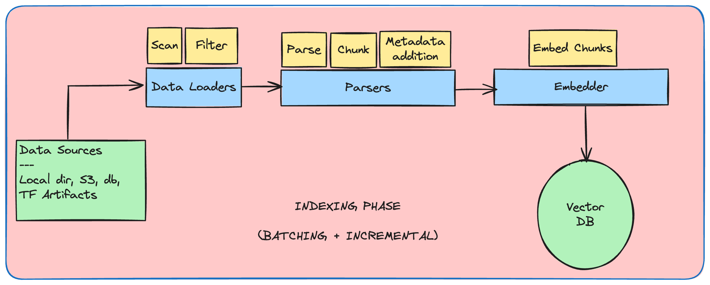

This phase involves loading data from sources, parsing the documents present in these sources and indexing them in the vector db. To handle large quantities of documents encountered in production, Cognita takes this a step further.

1. Cognita groups documents in batches, rather than indexing them all together.
2. Cognita keeps computes and keeps track of document hash so that whenever a new document is added to the data source for indexing only those documents are indexed rather than indexing the complete data source, this save time and compute dramatically.
3. This mode of indexing is also referred as `INCREMENTAL` indexing, there is also other mode that is supported in Cognita that is `FULL` indexing. `FULL` indexing re-ingests the data into vector db irrespective of any vector data present for the given collection.

### Response Generation

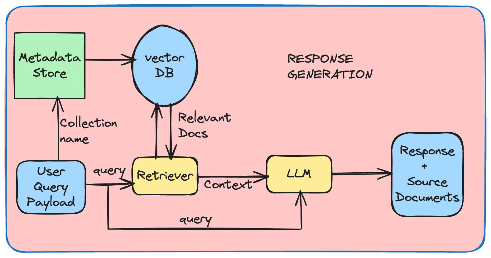

Response generation phase makes a call to the `/answer` endpoint of your defined `QueryController` and generates the response for the requested query.

## Using Cognita UI

The following steps will showcase how to use the cognita UI to query documents:

1. Create Data Source

    - Click on `Data Sources` tab
      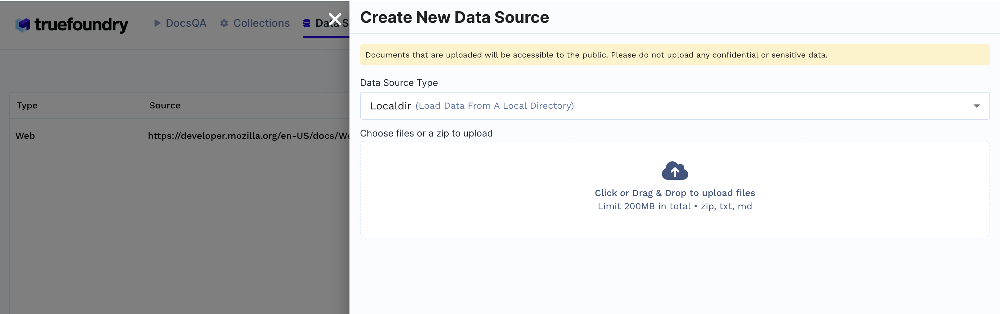
    - Click `+ New Datasource`
    - Data source type can be either files from local directory, web url, github url or providing Truefoundry artifact FQN.
        - E.g: If `Localdir` is selected upload files from your machine and click `Submit`.
    - Created Data sources list will be available in the Data Sources tab.
      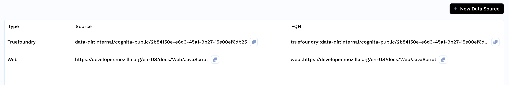

2. Create Collection
    - Click on `Collections` tab
    - Click `+ New Collection`
      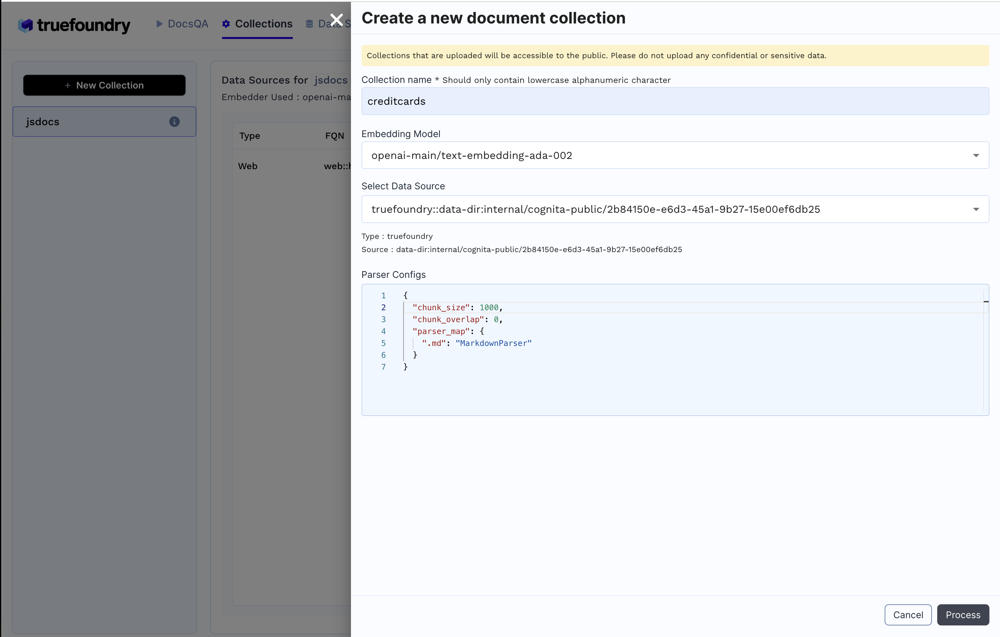
    - Enter Collection Name
    - Select Embedding Model
    - Add earlier created data source and the necessary configuration
    - Click `Process` to create the collection and index the data.
      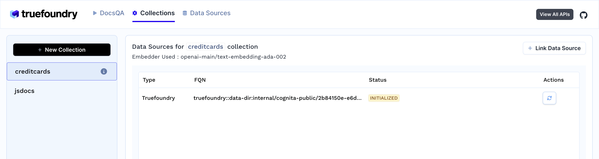
3. As soon as you create the collection, data ingestion begins, you can view it's status by selecting your collection in collections tab. You can also add additional data sources later on and index them in the collection.
   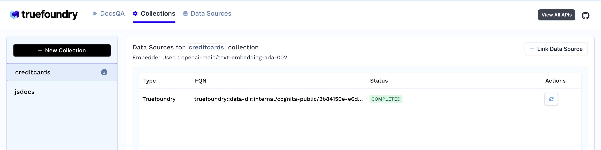
4. Response generation
   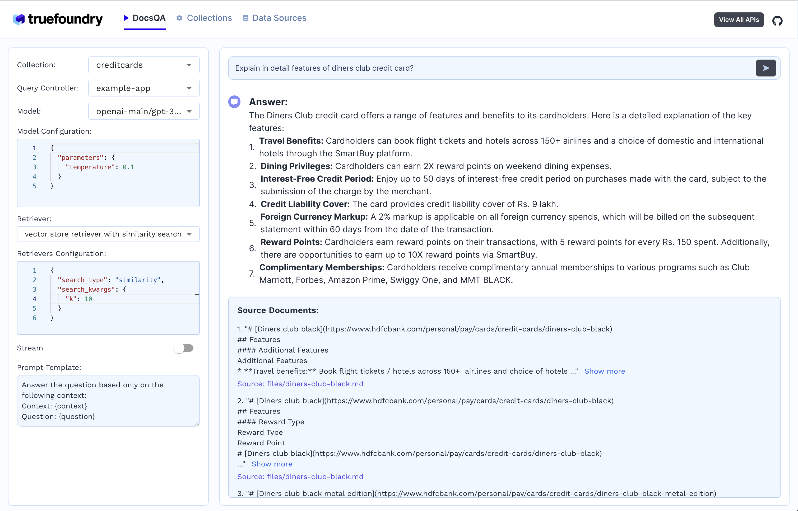

    - Select the collection
    - Select the LLM and it's configuration
    - Select the document retriever
    - Write the prompt or use the default prompt
    - Ask the query
